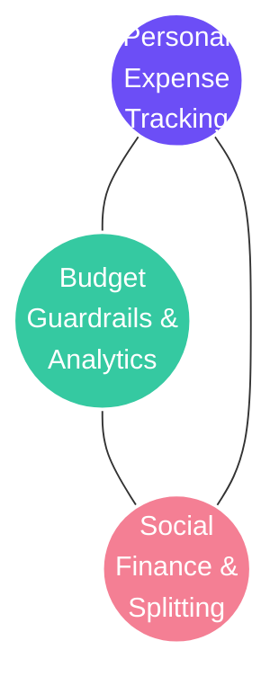
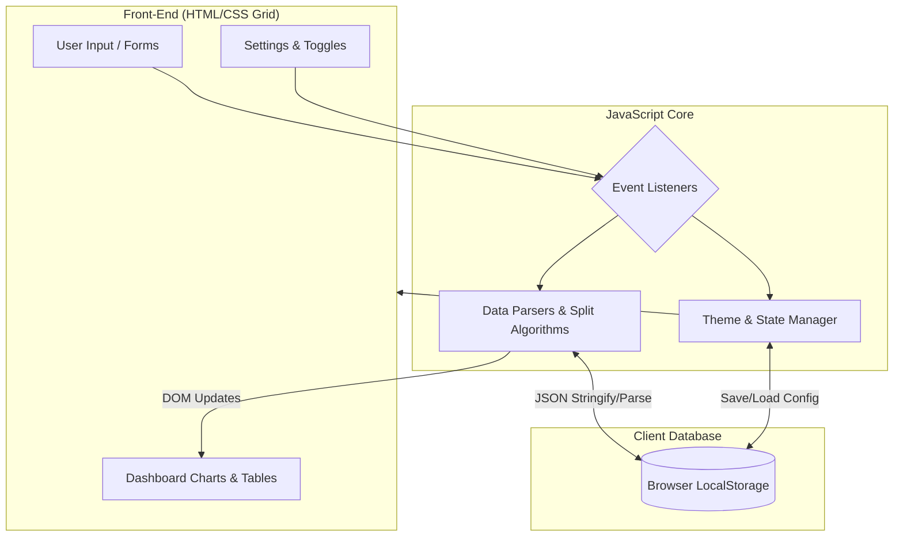

# 🚀 PocketMate: Student Expense Tracker


> **Smart Spending for Students.** A unified, client-side web application engineered to help college students track daily expenses, enforce budget guardrails, and seamlessly split shared hostel bills without the overhead of complex banking apps.

---

## 📑 Table of Contents

1. [About the Project & Mission](#-1-about-the-project--mission)
2. [Target Audience & Creative Use Cases](#-2-target-audience--creative-use-cases)
3. [Core Philosophy](#-3-core-philosophy)
4. [Granular Module-by-Module Feature Breakdown](#-4-granular-module-by-module-feature-breakdown)
5. [Technical Architecture & Engineering Specifications](#-5-technical-architecture--engineering-specifications)
6. [Future Scope, System Scalability & Production Roadmap](#-6-future-scope-system-scalability--production-roadmap)
7. [Local Setup & Installation](#-7-local-setup--installation)
8. [Team Members](#-8-team-members)

---

## 📖 1. About the Project & Mission

College students frequently struggle with financial anxiety due to limited monthly allowances, shared hostel living expenses, and the lack of tools tailored specifically for them. **PocketMate** is built to eliminate cognitive overload.

**Our Mission:** To eliminate financial anxiety and social awkwardness among college students by providing an accessible, highly visual, and completely private tool for money management. We aim to foster early financial literacy, encourage disciplined saving for personal and shared goals, and simplify hostel/dorm living through transparent peer-to-peer expense tracking.

---

## 🎯 2. Target Audience & Creative Use Cases

PocketMate specifically targets college students and young adults managing limited monthly allowances.

- **Hostel living & roommates:** Tracking shared rent, electricity bills, and groceries with roommates, ensuring everyone pays their fair share automatically.
- **Goal tracking:** Visually tracking savings progress for large purchases like a MacBook, an Emergency Fund, or a Goa trip using dedicated progress pools.
- **Daily allowances:** Monitoring daily food, transport, and education expenses to stay within a strict monthly budget limit and avoid end-of-month financial stress.
- **Society/club fest management:** Using the "Shared Pools" feature to track budget allocations for different college fest departments.
- **International/exchange students:** Utilizing the multi-currency toggle to track expenses locally while setting the UI to output their home currency (USD, EUR, GBP).

---

## 🧠 3. Core Philosophy

PocketMate sits at the perfect intersection of three primary financial pillars for students:



---

## 🧩 4. Granular Module-by-Module Feature Breakdown

### Module 1: Entry, Marketing & Authentication Architecture

- **Automated splash screen** (`index.html`): Utilizes an isolated CSS animation cycle featuring a 5-second progress track combined with an infinite gradient shimmer effect. *Pros:* provides visual feedback during initial asset caching.
- **Adaptive dual-navigation system:** Employs CSS media queries to swap between a fixed top desktop navigation bar and a glassmorphism floating bottom action bar on mobile viewports.
- **Split-screen authentication** (`signin.html`, `signup.html`): Features a two-column desktop grid with a branded gradient showcase on the left and form controls on the right. Includes demo bypass credentials (`test@student.com`) for frictionless evaluation.

### Module 2: The Command Dashboard (`dashboard.html`)

- **Algorithmic financial health score:** An integrated widget that calculates a dynamic score (e.g., 87/100) based on spending-to-income ratios.
- **Summary KPI matrix:** A four-column CSS grid displaying Total Income, Total Expenses, Total Savings, and Budget Left with percentage delta indicators.
- **Spending overview donut:** Built using CSS conic gradients (`conic-gradient`) overlaid on a circular mask, paired with a dynamic text legend.
- **Peer-to-peer debt summary ledger:** A dedicated social finance section tracking bilateral debts with friends (e.g., "Rahul Owes you ₹250").

### Module 3: Expense Manager & Smart Splitter (`expensemanager.html`)

- **Real-time transaction logging:** A form handler that captures Type, Category, Amount, and Date, updating UI charts instantly.
- **Dynamic monthly budget guardrail:** Calculates spent totals against an adjustable budget limit, updating the progress bar width and warning states in real time.
- **Smart bill splitting calculator:** Solves the classic hostel problem by dividing shared costs equally or via custom amounts among a list of friends (e.g., Rahul, Aman, Priya).
- **Shared pools & goals:** Progress tracking widgets for personal targets (MacBook) and shared group pools (Room Rent).

### Module 4: Analytics, Preferences & Data Utilities (`reports.html`, `settings.html`)

- **Multi-horizon SVG trajectory graphs:** Features an SVG line chart with plotted coordinates, switchable across Monthly, Weekly, and Yearly views.
- **Comparative bar matrix:** Paired CSS bar charts comparing weekly income against expenses using color-coded mint and coral indicators.
- **Global theme & customization engine:** Offers a master Light/Dark mode toggle, UI text size adjustments, and multiple currency options (INR, USD, EUR, GBP) saved to client storage.
- **Client data portability (CSV/JSON backup):** Uses client-side Blob triggers to export financial history as a standard `.csv` file and preferences as `.json`.
- **Slide-over support dock:** A slide-over drawer with an animated CSS backdrop blur for immediate feedback without context switching.

---

## 🏗️ 5. Technical Architecture & Engineering Specifications

PocketMate is engineered as a modern, lightweight, client-side web application relying entirely on native web standards.



### 5.1 CSS Grid Layout Architecture

PocketMate heavily utilizes CSS Grid to construct complex, two-dimensional interfaces.

- **Desktop workspaces (1024px+):** Employs multi-column templates like `grid-template-columns: 1.3fr 1fr 1fr;` to display entry forms, progress gauges, and chart legends side by side.
- **Mobile viewports (under 700px):** Collapses all multi-column grids down to a single column (`grid-template-columns: 1fr;`), refactors the fixed sidebar into a slim icon rail (`width: 74px`), and activates the mobile bottom navigation bar.

### 5.2 Advanced CSS Visual Techniques

- **Glassmorphism:** The floating mobile navigation bar uses `backdrop-filter: blur(14px)` combined with semi-transparent background colors to create a frosted glass effect.
- **Zero-dependency charting:** The circular expense breakdown chart is created purely via CSS using the `conic-gradient()` property, bypassing the need for heavy JS charting libraries like Chart.js.

### 5.3 Iconography via Phosphor Icons CDN

The platform integrates the Phosphor Icons Web Library via the unpkg CDN. Icons are injected using simple `<i>` tags (e.g., `<i class="ph ph-wallet"></i>`), which render as web fonts for seamless resizing and styling.

### 5.4 Vanilla JavaScript State Management

Without relying on a backend database, PocketMate uses client-side JavaScript to simulate a full application lifecycle. Form submissions intercept the default page reload using `e.preventDefault()` and dynamically rewrite the DOM to provide instant visual feedback.

---

## 🚀 6. Future Scope, System Scalability & Production Roadmap

In its initial implementation, PocketMate operates purely as an offline-first, client-side application utilizing Vanilla JavaScript. Scaling to a production-grade SaaS platform requires transitioning to a distributed backend system.

### 6.1 Future Distributed Architecture

```
+-----------------------------------------------------------------------------------+
|                        API GATEWAY & LOAD BALANCER (Nginx)                        |
|   Rate Limiting  |  SSL Termination  |  JWT Authentication  |  CORS & Security    |
+------------------------------------------+----------------------------------------+
                                           |
         ┌─────────────────────────────────┼────────────────────────────────┐
         ▼                                 ▼                                ▼
+--------------------+           +--------------------+           +--------------------+
|  USER & AUTH SVC   |           |  TRANSACTION SVC   |           |   SOCIAL & SPLIT   |
| (NestJS / Node.js) |           |  (FastAPI / Python)|           |  (Go / WebSockets) |
+---------+----------+           +---------+----------+           +---------+----------+
          │                                │                                │
          ▼                                ▼                                ▼
+--------------------+           +--------------------+           +--------------------+
|   POSTGRESQL DB    |           |    REDIS CACHE     |           |  APACHE KAFKA /    |
| (Relational Data)  |           | (Session / Scores) |           |   RABBITMQ QUEUE   |
+--------------------+           +--------------------+           +--------------------+
```

### 6.2 Relational Database Schema (PostgreSQL)

To replace in-memory arrays, PocketMate will implement a normalized relational database schema featuring `USERS`, `CATEGORIES`, and `TRANSACTIONS` tables. It will utilize double-entry bookkeeping principles where each social split transaction generates balanced debit and credit entries.

### 6.3 Automated Data Ingestion

- **Reserve Bank of India (RBI) Account Aggregator Framework:** Fetches digitally signed bank statement data with explicit user consent.
- **OCR smart receipt scanning:** Leverages Tesseract.js / Google ML Kit to extract line items and taxes from physical restaurant bills for perfect group splitting.

### 6.4 Social Financial Layer & UPI Integration

- **Dynamic UPI deep linking:** Generates dynamic UPI intent links (`upi://pay?pa=recipient@upi...`) rendering instant QR codes on screen for one-tap debt settlement.
- **Graph-based debt simplification algorithm:** Runs a Minimum Cash Flow Graph Algorithm to reduce cross-debts in a friend group, minimizing total transaction volume by up to 60%.

```
UNOPTIMIZED (3 Transactions):
[ Rahul ] ──(₹200)──► [ Aman ] ──(₹200)──► [ Priya ] ──(₹200)──► [ Rahul ]

OPTIMIZED DEBT SIMPLIFICATION (0 Transactions):
Balances Net to Zero -> All Debts Automatically Cancelled!
```

---

## 💻 7. Local Setup & Installation

Since PocketMate is entirely client-side, installation is completely frictionless.

1. **Clone the repository:**
   ```bash
   git clone https://github.com/your-username/pocketmate.git
   ```
2. **Navigate to the directory:**
   ```bash
   cd pocketmate
   ```
3. **Run the application:**
   - Open `index.html` in any modern web browser.
   - Recommended for developers: use the Live Server extension in VS Code for hot-reloading.

---

## 🧑‍💻 8. Team Members

Conceptualized, designed, and developed by **Team 3**:

- 👑 **Abhinav Khare** (Roll No: 2510992558) — Team Lead & Architecture Planning
- 🎨 **Suhani Aggarwal** (Roll No: 2510992563) — UI/UX Designer
- 💻 **Tisha Mittal** (Roll No: 2510992658) — Front-End Developer
- 📝 **Charu Muthreja** (Roll No: 2510993165) — Content Strategy & Research

---

## 📄 License

© 2026 PocketMate. All Rights Reserved. Built for students, by students.
